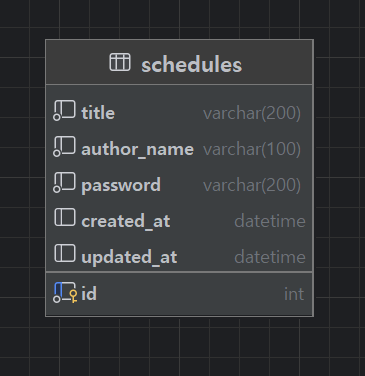

# 개발자용 README: 스케줄러 프로그램

## 프로젝트 개요

이 프로젝트는 스케줄러 프로그램을 개발하기 위해 설계되었습니다. Java와 Gradle을 기반으로 하며, 일정 관리와 알림 기능을 제공하는 데 초점을 맞췄습니다. 개발자는 프로젝트를 확장하거나 사용자 정의 기능을 추가할 수 있도록 구조화되어 있습니다.

## 주요 기능

- 일정 생성, 조회, 수정, 삭제
- 사용자 데이터 저장 및 로드 (파일 또는 데이터베이스)

## 프로젝트 구조

```

 src                  # 소스 코드 폴더
    ├── main/java        # 핵심 애플리케이션 클래스 파일
    │   ├── com/example/schedules/SchedulesApplication.java
    │   ├── com/example/schedules/controller/ScheduleController.java
    │   ├── com/example/schedules/dto/ScheduleRequestDto.java
    │   ├── com/example/schedules/dto/ScheduleResponseDto.java
    │   ├── com/example/schedules/entity/Schedule.java
    │   ├── com/example/schedules/repository/ScheduleRepository.java
    │   ├── com/example/schedules/repository/ScheduleRepositoryImpl.java
    │   ├── com/example/schedules/service/ScheduleService.java
    └── └── com/example/schedules/service/ScheduleServiceImpl.java
 
```

## 개발 환경 설정

### 요구 사항

- Java 17 이상
- Gradle 7.x 이상
- IntelliJ IDEA (선택 사항)

## 개발자 가이드

### 코드 구조

- `src/main/java`에 애플리케이션의 핵심 로직이 포함됩니다.

### 주요 클래스

- **SchedulesApplication**: 애플리케이션의 진입점.
- **ScheduleController**: 일정 관련 요청을 처리하는 컨트롤러.
- **ScheduleRequestDto**: 일정 생성 요청을 위한 DTO.
- **ScheduleResponseDto**: 일정 응답 데이터를 위한 DTO.
- **Schedule**: 일정 엔티티.
- **ScheduleRepository**: 일정 데이터 저장소 인터페이스.
- **ScheduleRepositoryImpl**: 일정 데이터 저장소 구현체.
- **ScheduleService**: 일정 비즈니스 로직 서비스.
- **ScheduleServiceImpl**: 서비스 인터페이스 구현체.

### 데이터베이스 설정

현재 이 프로젝트는 파일 기반 저장소를 사용합니다. 데이터베이스로 전환하려면 `application.properties`에서 설정을 수정하고, 필요한 의존성을 추가해야 합니다.

### 디버깅 및 로그 확인

- 기본 로그 설정은 `application.properties` 파일에서 구성할 수 있습니다.

## 기여 방법

1. 이 저장소를 포크합니다.
2. 새 브랜치를 생성합니다:
   ```bash
   git checkout -b feature/[feature-name]
   ```
3. 변경 사항을 커밋합니다:
   ```bash
   git commit -m "[커밋 메시지]"
   ```
4. 브랜치에 푸시합니다:
   ```bash
   git push origin feature/[feature-name]
   ```
5. 풀 리퀘스트를 생성합니다.

---
## ERD

## API 명세서


